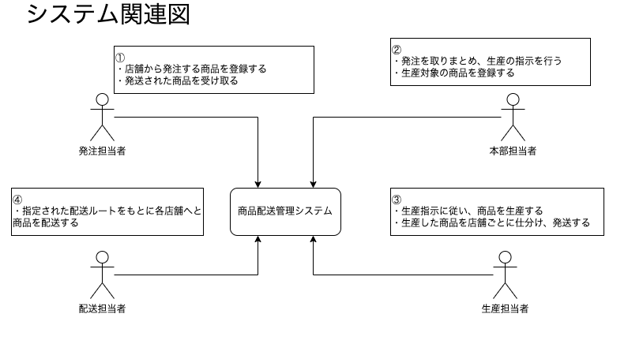
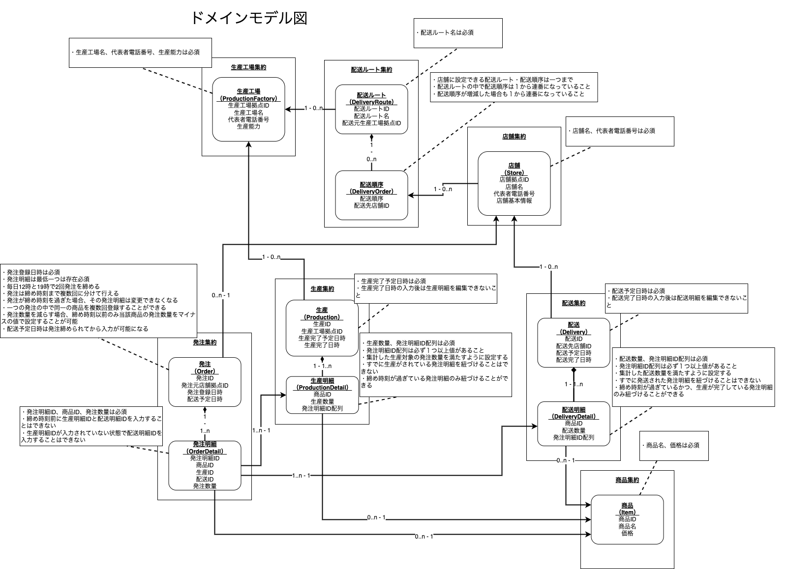
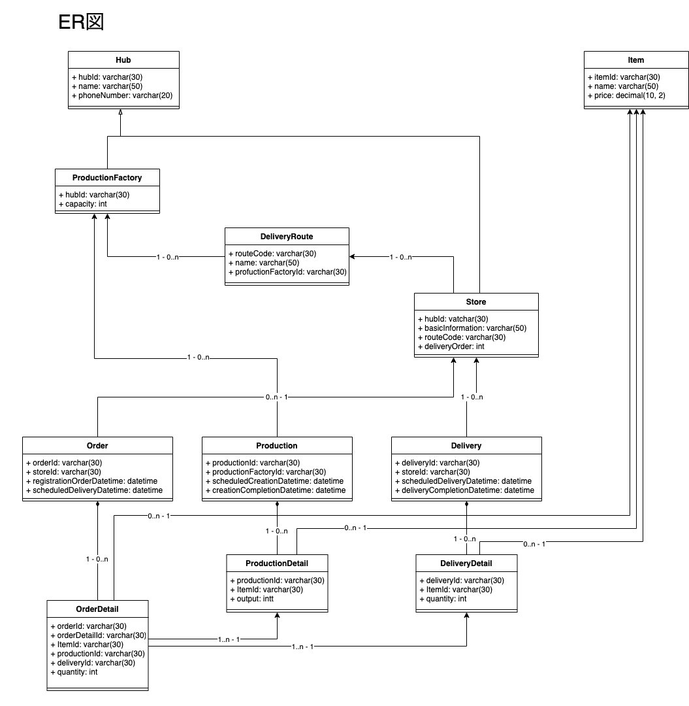

# sample-ddd-laravel

* PHP/LaravelでのDDDとモノリポの実験用リポジトリ
  * PHP: 8.1
  * Laravel: 8.7

### 目次
- [ディレクトリ構成](#ディレクトリ構成)
- [サンプルプロジェクト内容](#サンプルプロジェクト内容)
- [環境構築](#環境構築)

## ディレクトリ構成

```
sample-ddd-laravel
├ delivery-api (Laravel Project) // ControllerやUseCase、その他Laravelの基本的な機能管理用
├ delivery-app (Package)         // ユースケース層（UseCases, QuerySrevice Interface）
├ delivery-docker                // docker関連の設定用
├ delivery-domain (Package)      // ドメイン層（Domain Entity, Repository Interface）
├ delivery-infra (Package)       // インフラ層（RepositoryImpl, QueryServiceImpl, Model, Migration, Seeder）
└ delivery-tools                 // 開発用ツール置き場
```

* ECサイトと管理画面のようにAPI自体を分けたい場合は`delivery-ec-api`, `delivery-cms-api`のようにプロジェクトを増やし、ユースケース層やドメイン層、インフラ層は使い回す。
* DBに関するものは全て`delivery-infra`で完結させている。
  * 特にEloquentはapiやdomainには絶対に漏らさないようにし、Domain Entityのみでやりとりを行っている。

## サンプルプロジェクト内容

IPAの情報処理技術者試験のひとつであるデータベーススペシャリストの過去問のうち、2020年の午後Ⅰ 問1を参考にした。  
https://www.jitec.ipa.go.jp/1_04hanni_sukiru/mondai_kaitou_2020r02.html

商品を発注してから納品されるまでの一通りの流れを管理する商品配送管理システムとなる。  
ただしあくまで今回のスコープは商品に関するドメインなので、ユーザー周りなど一部仕様を簡略化し省いている。

[drowioで見たい場合はこちら](https://drive.google.com/file/d/1cHRGPJn6886WOA2PSXlC8JonNy_OsSJ7/view?usp=sharing)

### システム関連図


### ドメインモデル図


### ER図


## 環境構築

### Docker立ち上げ
`sh ./delivery-tools/docker-up.sh`

### DBリセット
`sh ./delivery-tools/reset-data.sh`

### エンドポイント
http://localhost:15280

### テスト
`sh ./delivery-tools/delivery-api-test.sh`  
`sh ./delivery-tools/delivery-domain-test.sh`  
`sh ./delivery-tools/delivery-infra-test.sh`

